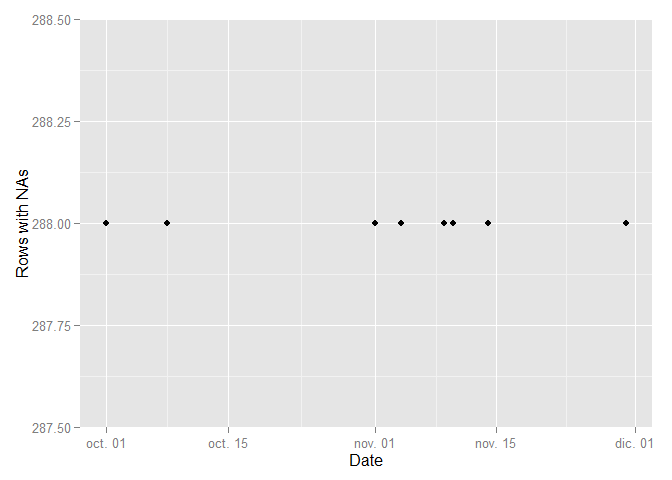

# Reproducible Research: Peer Assessment 1


## Loading and preprocessing the data


```
## 
## Attaching package: 'dplyr'
## 
## The following object is masked from 'package:stats':
## 
##     filter
## 
## The following objects are masked from 'package:base':
## 
##     intersect, setdiff, setequal, union
## 
## Loading required package: grid
```
## What is mean total number of steps taken per day?

###1. Make a histogram of the total number of steps taken each day

```r
pm.dayly <- aggregate(activity$steps, list(activity$date), sum, na.rm=T)
names(pm.dayly) <- c("Day", "Total_steps")
qplot(pm.dayly$Total_steps,
      geom="histogram",
      binwidth = 3000,  
      main = "Total number of steps taken each day", 
      xlab = "Total Steps",  
      fill=I("red"))
```

 

###2. Calculate and report the mean and median total number of steps taken per day


```r
ggplot(pm.dayly, aes(y = as.numeric(pm.dayly$Total_steps), 
                     x = as.Date(pm.dayly$Day),colour="data",shape="data",group=1 )) + 
      geom_point() +
      labs(x="2012",y="Total steps in a day") +
      scale_x_date(breaks = "1 month", minor_breaks = "1 week", labels=date_format("%B")) +
      stat_summary(aes(colour="mean",shape="mean",group=2),
               fun.y = function(x) mean(pm.dayly$Total_steps), 
               fun.ymin = function(x) mean(pm.dayly$Total_steps), 
               fun.ymax = function(x) mean(pm.dayly$Total_steps)) +     
      stat_summary(aes(colour="median",shape="median",group=3),
               fun.y = function(x) median(pm.dayly$Total_steps), 
               fun.ymin = function(x) median(pm.dayly$Total_steps), 
               fun.ymax = function(x) median(pm.dayly$Total_steps)) +
      scale_color_manual(values=c("#004E00", "#33FF00", "#FF9966")) +
      scale_shape_manual(values=c(1, 2,3))+
      theme(legend.title=element_blank())
```

 

## What is the average daily activity pattern?

###1. Make a time series plot (i.e. type = "l") of the 5-minute interval (x-axis)
###and the average number of steps taken, averaged across all days (y-axis)

```r
pm.5itval <- aggregate(activity$steps, list(activity$interval), mean, na.rm=T)
names(pm.5itval) <- c("Interval", "Average_steps")
ggplot(pm.5itval, aes(y = as.numeric(pm.5itval$Average_steps), 
                          x = as.numeric(pm.5itval$Interval))) + 
      geom_line() +
      labs(x="5 minutes interval",y="Average Steps")
```

 

###2. Which 5-minute interval, on average across all the days in the dataset,
###contains the maximum number of steps?

```r
sel.5itval <- filter(pm.5itval, 
                     as.numeric(pm.5itval$Interval) >= 800 & 
                     as.numeric(pm.5itval$Interval) <= 900)
ggplot(sel.5itval, aes(y = as.numeric(sel.5itval$Average_steps), 
                       x = as.numeric(sel.5itval$Interval))) + 
      geom_line() +
      labs(x="5 minutes interval",y="Average Steps")
```

 

```r
sel2.5itval <- filter(pm.5itval, 
                      as.numeric(pm.5itval$Interval) >= 825 & 
                      as.numeric(pm.5itval$Interval) <= 850)
ggplot(sel2.5itval, aes(y = as.numeric(sel2.5itval$Average_steps), 
                        x = as.numeric(sel2.5itval$Interval))) + 
      geom_line() +
      labs(x="5 minutes interval",y="Average Steps")
```

 


## Imputing missing values

###1. Calculate and report the total number of missing values in the dataset
###(i.e. the total number of rows with NAs)

```r
sel.nval <- filter(activity,is.na(activity$steps))
sel.nval["Count"] <-1
qtt.naval <- aggregate(sel.nval$Count, list(sel.nval$date), sum, na.rm=F)
names(qtt.naval) <- c("Date", "Qtt_NA")
ggplot(qtt.naval, aes(y = as.numeric(qtt.naval$Qtt_NA), x = as.Date(qtt.naval$Date))) + 
      geom_point() +
      labs(x="Date",y="Rows with NAs")
```

 


###2. Devise a strategy for filling in all of the missing values in the dataset.
###The strategy selected is the substitution for the mean registered for the corresponding 5-minute interval
###3. Create a new dataset that is equal to the original dataset but with the
###missing data filled in.

```r
mqtt.naval <- activity %>% 
  group_by( interval ) %>%
  transform(steps = ifelse(is.na(steps), 
                               mean(steps, na.rm = TRUE), 
                               steps)
  )
```

###4. Make a histogram of the total number of steps taken each day

```r
pmb.dayly <- aggregate(mqtt.naval$steps, list(mqtt.naval$date), sum, na.rm=T)
names(pmb.dayly) <- c("Day", "Total_steps")
qplot(pmb.dayly$Total_steps,
          geom="histogram",
          binwidth = 3000,  
          main = "Total number of steps taken each day", 
          xlab = "Total Steps",  
          fill=I("red"))
```

 

###Calculate and report the mean and median total number of steps taken per day.
###What is the impact of imputing missing data on the estimates of the total
###daily number of steps?

```r
ggplot(pmb.dayly, aes(y = as.numeric(pmb.dayly$Total_steps), 
                      x = as.Date(pmb.dayly$Day),colour="data",shape="data",group=1 )) + 
      geom_point() +
      labs(x="2012",y="Total steps in a day") +
      scale_x_date(breaks = "1 month", minor_breaks = "1 week", labels=date_format("%B")) +
      stat_summary(aes(colour="mean",shape="mean",group=2),
                   fun.y = function(x) mean(pmb.dayly$Total_steps), 
                   fun.ymin = function(x) mean(pmb.dayly$Total_steps), 
                   fun.ymax = function(x) mean(pmb.dayly$Total_steps)) +     
      stat_summary(aes(colour="median",shape="median",group=3),
                   fun.y = function(x) median(pmb.dayly$Total_steps), 
                   fun.ymin = function(x) median(pmb.dayly$Total_steps), 
                   fun.ymax = function(x) median(pmb.dayly$Total_steps)) +
      scale_color_manual(values=c("#004E00", "#33FF00", "#FF9966")) +
      scale_shape_manual(values=c(1, 2,3))+
      theme(legend.title=element_blank())
```

 

## Are there differences in activity patterns between weekdays and weekends?
###1. Create a new factor variable in the dataset with two levels - "weekday"
###and "weekend" indicating whether a given date is a weekday or weekend day.

```r
mqtt.naval$weekday <- ifelse((weekdays(as.Date(mqtt.naval$date)) == "sábado" | 
                              weekdays(as.Date(mqtt.naval$date)) == "domingo"), 
                             "weekend", "weekday")
mmqtt.naval <- filter(mqtt.naval, mqtt.naval$weekday == "weekend")
aggmqtt.naval <- aggregate(mmqtt.naval$steps, list(mmqtt.naval$interval), mean, na.rm=T)
names(aggmqtt.naval) <- c("Interval", "Average_steps")
```

###2. Make a panel plot containing a time series plot (i.e. type = "l") of the
###5-minute interval (x-axis) and the average number of steps taken, averaged
###across all weekday days or weekend days (y-axis).

```r
p1<-ggplot(aggmqtt.naval, aes(y = as.numeric(aggmqtt.naval$Average_steps), 
                          x = as.numeric(aggmqtt.naval$Interval))) + 
      geom_line() +
      labs(x="5 minutes interval",y="Average Steps") +
      labs(title = "Weekend")
mmmqtt.naval <- filter(mqtt.naval, mqtt.naval$weekday == "weekday")
aggmmqtt.naval <- aggregate(mmmqtt.naval$steps, list(mmmqtt.naval$interval), mean, na.rm=T)
names(aggmmqtt.naval) <- c("Interval", "Average_steps")
p2<-ggplot(aggmmqtt.naval, aes(y = as.numeric(aggmmqtt.naval$Average_steps), 
                           x = as.numeric(aggmmqtt.naval$Interval))) + 
      geom_line() +
      labs(x="5 minutes interval",y="Average Steps")+
      labs(title = "Weekday")
grid.arrange(p1,p2, ncol = 1, main = "Differences in activity patterns")
```

 

